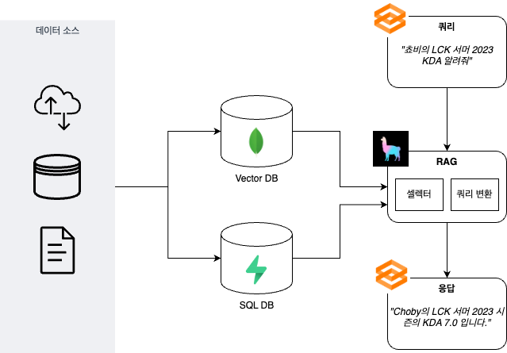

# e스포츠 시맨틱 검색 앱
## 시스템 아키텍처


## 기술 스택
- UI: [Gradio](https://www.gradio.app)
- RAG: [LlamaIndex](https://www.llamaindex.ai)


## 시작하기

### 시스템 요구사항
- Python 3.11
- [Poetry](https://python-poetry.org/)

### 로컬 실행
OpenAI API 키가 필요합니다. [여기](https://platform.openai.com/api-keys)에서 API 키를 생성후 아래와 같이 환경 변수로 설정해주세요.

```shell
$ export OPENAI_API_KEY=<YOUR_OPENAI_API_KEY>
```

`poetry run` 커맨드로 실행 합니다.
```
$ poetry run python e_sports_semantic_search/main.py
```

웹 브라우저에서 `http://127.0.0.1:7860` 주소에 접속합니다.